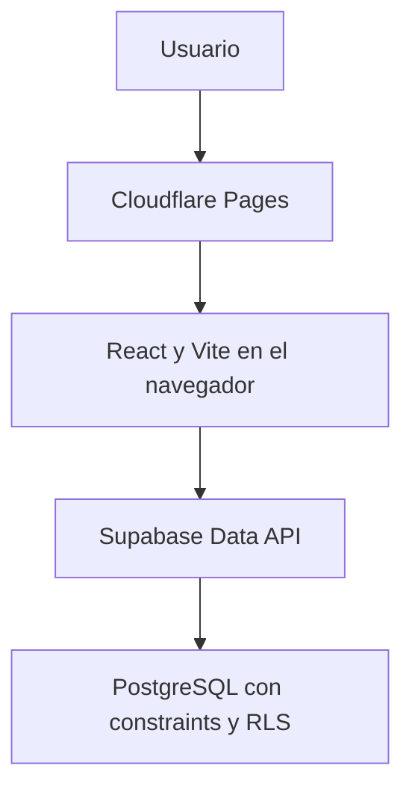

# MikuyApp

[](https://github.com/fcamasca/mikuyapp-restaurant-ops/actions/workflows/ci.yml)
[](LICENSE)
[](.nvmrc)

Sistema web de operaciones para restaurantes orientado al flujo **mesa → pedido → cocina → entrega → pago**.

**Estado actual:** hitos H1 y H2 completados y aceptados. H3 todavía no ha sido iniciado.

**Producción:** <https://mikuyapp.pages.dev/>

**Preview H2:** <https://feature-h2-usuarioscartamesa.mikuyapp.pages.dev/>

## Problema y objetivo

La operación de un restaurante requiere coordinar a mozos, cocina y caja. Cuando esa coordinación depende principalmente de comunicación verbal, aumenta el riesgo de pedidos incompletos, estados poco claros y errores al cobrar.

MikuyApp busca centralizar mesas, carta, pedidos, estados operativos y pagos para reducir esos problemas. El alcance inicial está diseñado para un solo local.

H1 establece la base técnica verificable y H2 incorpora autenticación, roles, carta y mesas. El flujo de pedidos comienza en H3 y todavía no está implementado.

## Estado del proyecto

| Hito | Resultado | Estado |
|---|---|---|
| H1 | Base técnica, Supabase y despliegue | Aceptado |
| H2 | Usuarios, carta y mesas | Aceptado |
| H3 | Flujo del mozo | No iniciado |
| H4 | Cocina en tiempo real | Pendiente |
| H5 | Caja e impresión | Pendiente |
| H6 | MVP liberado | Pendiente |

## Funcionalidades disponibles

La aplicación permite comprobar:

- URL productiva: <https://mikuyapp.pages.dev/>;
- Preview validado de H2: <https://feature-h2-usuarioscartamesa.mikuyapp.pages.dev/>;
- local demo `MIKUY-DEMO`;
- autenticación, restauración de sesión y cierre de sesión;
- contexto propio de perfil, rol y local;
- rutas protegidas y destinos por rol;
- carta operativa agrupada por categorías activas;
- tablero de mesas activas para el mozo con los cuatro estados operativos;
- administración completa de categorías, productos y mesas;
- página técnica autenticada para los cuatro roles;
- presentación responsive validada en celular, tablet y escritorio.

H2 no incluye todavía creación de pedidos, comandas de cocina, Realtime, cobro ni pagos. Esas capacidades corresponden a H3–H5.

## Roles y rutas

| Rol | Destino después del login | Accesos H2 |
|---|---|---|
| `ADMINISTRADOR` | `/admin/catalogo` | Administración de categorías, productos y mesas; acceso a `/tecnica` |
| `MOZO` | `/mozo/mesas` | Carta operativa, tablero de mesas y acceso a `/tecnica` |
| `COCINA` | `/tecnica` | Página técnica autenticada |
| `CAJA` | `/tecnica` | Página técnica autenticada |

Las rutas protegidas requieren sesión y contexto válidos. Un acceso de rol no autorizado se dirige a `/403`; una sesión ausente se dirige a `/login`.

## Arquitectura



- Cloudflare Pages sirve un frontend estático.
- El navegador consulta Supabase mediante una clave publicable apta para frontend.
- PostgreSQL es la fuente de verdad del modelo y los datos demo.
- RLS y los permisos PostgreSQL protegen el acceso en la base de datos.
- H1 no incorpora un backend personalizado.

## Stack técnico

| Componente | Tecnología | Responsabilidad |
|---|---|---|
| Interfaz | React `19.2.8` | Renderizado y estados de la página técnica |
| Lenguaje | TypeScript `7.0.2` | Tipado estático del frontend y servicios |
| Desarrollo y build | Vite `8.2.2` | Servidor local y generación de `dist` |
| Estilos | Tailwind CSS `4.3.3` | Utilidades visuales y diseño responsive |
| Cliente de datos | `@supabase/supabase-js` `2.112.3` | Consultas públicas a Supabase Data API |
| Base de datos | PostgreSQL administrado por Supabase | Persistencia, constraints, permisos y RLS |
| Herramientas Supabase | Supabase CLI `2.115.0` | Migraciones, lint y verificaciones SQL |
| Runtime | Node.js `22.12.0` | Ejecución de herramientas y scripts |
| Paquetes | npm `10.9.0` | Instalación reproducible mediante lockfile |
| Hosting | Cloudflare Pages | Publicación del frontend estático |

## Alcance implementado en H1 y H2

- Proyecto Vite con React y TypeScript.
- Tailwind CSS con comportamiento responsive.
- Cliente Supabase tipado con lecturas públicas H1 y acceso autenticado protegido.
- Login, logout, persistencia de sesión y contexto de autorización.
- Rutas y guardas por rol.
- Página técnica autenticada.
- Esquema PostgreSQL inicial.
- Seed demo idempotente.
- Permisos PostgreSQL y RLS para el acceso anónimo mínimo.
- Privilegios por columna y políticas RLS para usuarios autenticados.
- Carta agrupada y tablero de mesas del mozo.
- CRUD administrativo de categorías, productos y mesas.
- Pruebas SQL de esquema, restricciones y seed.
- 212 pruebas automatizadas y verificaciones reales con los cuatro roles.
- Producción H1 y Preview H2 publicados en Cloudflare Pages.

### Fuera del alcance implementado

- Registro y gestión operativa de pedidos.
- Flujo de cocina.
- Caja y pagos.
- Impresión.
- Realtime.
- Reportes.

## Modelo de datos

Las diez tablas se agrupan por responsabilidad:

- **Configuración y catálogo:** `local`, `rol`, `mesa`, `categoria`, `producto`.
- **Identidad:** `perfil_usuario`.
- **Operación futura:** `pedido`, `detalle_pedido`, `historial_estado`, `pago`.

Métricas verificadas en H1:

| Elemento | Cantidad |
|---|---:|
| Tablas | 10 |
| Columnas | 62 |
| PK | 10 |
| FK | 16 |
| UNIQUE | 9 |
| CHECK | 23 |
| Índices adicionales | 12 |
| Columnas identity | 5 |

La definición completa se encuentra en el [diseño técnico de H1](specs/H1-TechnicalBasis/design.md).

## Datos demo

| Recurso | Cantidad |
|---|---:|
| Roles | 4 |
| Locales | 1 |
| Mesas | 6 |
| Categorías | 5 |
| Productos | 10 |
| Cuentas Auth y perfiles H2 | 4 |
| Filas transaccionales permanentes | 0 |

El seed usa códigos naturales, es idempotente y conservó los mismos 26 identificadores en ejecuciones repetidas.

## Seguridad

| Recurso | SELECT anon | Escritura anon |
|---|---|---|
| `local`, `mesa`, `categoria` y `producto` activos | Sí | No |
| `rol`, `perfil_usuario` y tablas transaccionales | No | No |
| Secuencias | No | No |

- La Publishable key es pública y apta para su uso en el frontend.
- La clave `service_role` está prohibida en el cliente, Git, bundle y logs.
- `.env.local` está ignorado y no se versiona.
- `authenticated` obtiene únicamente los privilegios por tabla y columna necesarios.
- RLS restringe perfil, rol, local y catálogos según usuario, rol, local y estado activo.
- Las tablas transaccionales permanecen inaccesibles durante H2.
- Las pruebas reales confirmaron aislamiento, rechazo de elevación y ausencia de cambios parciales.
- La auditoría final confirmó que no existen credenciales, tokens ni UUID Auth en Git, `dist` o logs.
- Ningún secreto privado debe llegar a Git, al bundle compilado ni a los logs.

## Inicio rápido

```bash
git clone https://github.com/fcamasca/mikuyapp-restaurant-ops.git
cd mikuyapp-restaurant-ops
npm ci
```

Crear el archivo local de entorno a partir de `.env.example`:

```bash
cp .env.example .env.local
```

En Windows PowerShell puede usarse:

```powershell
Copy-Item .env.example .env.local
```

Completar únicamente las variables públicas:

```dotenv
VITE_SUPABASE_URL=
VITE_SUPABASE_PUBLISHABLE_KEY=
```

Iniciar la aplicación:

```bash
npm run dev
```

## Comandos principales

| Comando | Propósito |
|---|---|
| `npm run dev` | Iniciar Vite en desarrollo |
| `npm run typecheck` | Validar TypeScript sin emitir archivos |
| `npm run build` | Generar el artefacto `dist` |
| `npm run test:auth` | Probar sesión, login y logout |
| `npm run test:profile` | Probar perfil, rol y local |
| `npm run test:routes` | Probar rutas y guardas |
| `npm run test:catalog` | Probar consultas administrativas y operativas |
| `npm run test:categories` | Probar administración de categorías |
| `npm run test:products` | Probar administración de productos |
| `npm run test:tables` | Probar administración de mesas |
| `npm run test:security` | Probar columnas protegidas e integridad |
| `npm run test:waiter` | Probar carta y tablero del mozo |
| `npm run test:responsive` | Probar contratos responsive y estados de interfaz |
| `npm run test:technical` | Probar la página técnica autenticada |
| `npm run verify:anon` | Validar lecturas permitidas y escrituras anónimas rechazadas |
| `npm run verify:h2-authenticated` | Ejecutar comprobaciones autenticadas reales cuando existan variables locales seguras y fixtures requeridos |
| `npm run preview` | Servir localmente el build generado |

## Estructura del repositorio

```text
docs/                  Documentación vigente y transversal
specs/
  H1-TechnicalBasis/   Spec, ejecución y aceptación de H1
scripts/               Verificaciones automatizadas
src/
  data/                Códigos y dataset demo
  pages/               Páginas React
  services/            Cliente y consultas Supabase
  types/               Tipos del dominio y servicios
supabase/
  migrations/          Esquema PostgreSQL versionado
  tests/               Pruebas SQL
  config.toml          Configuración local de Supabase CLI
  seed.sql             Datos demo idempotentes
```

Recursos de base de datos:

- [Migraciones](supabase/migrations/)
- [Seed demo](supabase/seed.sql)
- [Pruebas SQL](supabase/tests/)

## Calidad y pruebas

| Verificación | Cobertura |
|---|---|
| `npm ci` | Instalación reproducible desde `package-lock.json` |
| `npm run typecheck` | Validación TypeScript sin emisión |
| `npm run build` | Build de producción y generación de `dist` |
| `npm run verify:anon` | Lecturas públicas permitidas y escrituras anónimas rechazadas |
| Pruebas SQL | Esquema, constraints, índices, seed e idempotencia |
| GitHub Actions | Instalación limpia, typecheck y build en cada cambio relevante |

H1 cerró con TP-01–TP-20 aprobadas. H2 cerró con 212 pruebas automatizadas, verificaciones reales con cuatro roles y TP-01–TP-53 conformes.

## Documentación

- [Plan general del MVP](docs/PLAN_MVP.md)
- [Índice de especificaciones](specs/README.md)
- [Portada de H1](specs/H1-TechnicalBasis/README.md)
- [Requerimientos de H1](specs/H1-TechnicalBasis/requirements.md)
- [Diseño técnico de H1](specs/H1-TechnicalBasis/design.md)
- [Tareas de H1](specs/H1-TechnicalBasis/tasks.md)
- [Plan de pruebas de H1](specs/H1-TechnicalBasis/test-plan.md)
- [Evidencia de ejecución de H1](specs/H1-TechnicalBasis/execution.md)
- [Aceptación de H1](specs/H1-TechnicalBasis/acceptance.md)
- [Spec H2](specs/H2-UsersCatalogTables/h2_requirements.md)
- [Diseño H2](specs/H2-UsersCatalogTables/h2_design.md)
- [Tareas H2](specs/H2-UsersCatalogTables/h2_tasks.md)
- [Plan de pruebas H2](specs/H2-UsersCatalogTables/h2_test-plan.md)
- [Aceptación de H2](specs/H2-UsersCatalogTables/h2_acceptance.md)

## Siguiente etapa

H3 contempla el flujo del mozo: seleccionar mesa, crear el pedido, agregar productos y confirmar su envío. Todavía no ha sido iniciado.

## Licencia

MikuyApp se distribuye bajo la [MIT License](LICENSE).
