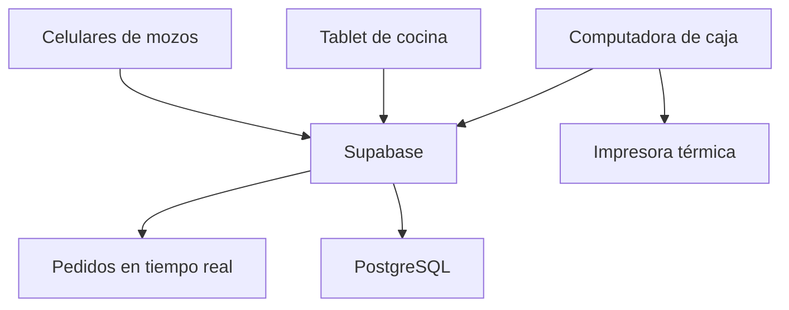

# MikuyApp — Plan del MVP para cebichería

## 1. Resumen del proyecto

Se desarrollará una aplicación web para gestionar el flujo operativo principal de una cebichería:

> Mozo registra el pedido → cocina lo prepara → mozo lo entrega → caja cobra y libera la mesa.

La solución utilizará **Supabase Free** y servicios gratuitos para evitar rentas tecnológicas mensuales.

### Nombre del producto

El nombre oficial de la aplicación será **MikuyApp**.

- **Mikuy** significa “comer” en quechua.
- Su sonoridad también recuerda a “mi cuy”, un referente reconocible de la gastronomía peruana.
- **App** comunica que se trata de una solución digital.
- El nombre conserva identidad peruana sin limitar el producto a una cevichería específica.

**Eslogan:** *MikuyApp — Tu restaurante en sincronía.*

**Nombre del repositorio:** `mikuyapp`

**Descripción breve:** Aplicación serverless para gestionar mesas, pedidos, cocina y caja en tiempo real.

| Condición | Definición |
|---|---|
| Duración | 2 semanas más 3 jornadas adicionales, manteniendo 2 horas máximas por jornada |
| Días de trabajo | Lunes a sábado |
| Dedicación diaria | 2 horas |
| Esfuerzo total | 29 horas; H2 requiere 9 horas (540 minutos) en lugar de las 4 inicialmente previstas |
| Locales incluidos | 1 |
| Mozos considerados | 2 |
| Estaciones | Cocina y caja |
| Backend | Supabase Free |
| Renta tecnológica mensual | S/0 |

> **Estado de planificación vigente (2026-08-27):** el plan base se conserva como referencia histórica. Las desviaciones aprobadas elevan la referencia actual de **24 h a 32.5 h**, sin implicar tiempo real consumido. El detalle se mantiene en [`docs/CHANGELOG_SCOPE.md`](CHANGELOG_SCOPE.md).

## 2. Objetivo

Construir y desplegar un MVP que permita registrar, preparar, entregar y cobrar pedidos desde celulares, tablet y computadora, manteniendo sincronizados a mozos, cocina y caja.

### Resultado esperado

Al finalizar las 15 jornadas de trabajo, correspondientes a dos semanas de lunes a sábado más tres jornadas adicionales:

1. El trabajador inicia sesión.
2. El mozo selecciona una mesa.
3. Registra los platos solicitados.
4. Envía el pedido.
5. Cocina lo recibe automáticamente.
6. Cocina actualiza su preparación.
7. El mozo visualiza cuándo está listo.
8. Caja registra el pago.
9. La mesa vuelve a quedar disponible.
10. El administrador consulta las ventas del día.
11. Caja imprime la precuenta o ticket interno.
12. El administrador puede exportar la información.

## 3. Usuarios y roles

### Administrador

- Crea, edita, elimina, activa y desactiva categorías, productos y mesas de su local.
- Consulta registros activos e inactivos; respeta dependencias históricas y restricciones de eliminación.
- Configura mesas sin modificar manualmente sus estados operativos.
- Consulta ventas.
- Exporta información.
- Accede a todas las funciones.

### Mozo

- Visualiza mesas.
- Abre pedidos.
- Agrega productos.
- Registra observaciones.
- Envía pedidos a cocina.
- Consulta el estado.
- Marca pedidos como entregados.

### Cocina

- Visualiza pedidos recibidos.
- Consulta observaciones.
- Cambia el estado de preparación.
- No puede modificar precios ni cobrar.

### Caja

- Consulta el consumo de una mesa.
- Imprime la precuenta.
- Registra la forma de pago.
- Cierra el pedido.
- Libera la mesa.
- Consulta el resumen del día.

## 4. Alcance del MVP

### 4.1 Inicio de sesión y seguridad

- Inicio y cierre de sesión.
- Usuarios asociados a un rol.
- Acceso diferenciado por función.
- Protección de información con Row Level Security.
- Restricción de operaciones según rol.
- Sesión persistente en dispositivos autorizados.

### 4.2 Carta

- Categorías: ceviches, chicharrones, arroces, combos y bebidas.
- Nombre y precio del producto.
- Estado disponible/no disponible.
- Visualización agrupada por categoría.
- Administración de categorías: creación, edición de código/nombre/orden, activación, desactivación y eliminación solo cuando no tengan productos relacionados.
- Administración de productos: creación, edición de código/nombre/precio/categoría, activación, desactivación y eliminación solo cuando no tengan detalles de pedidos relacionados.
- Las categorías inactivas, sus productos y los productos inactivos no aparecen en la carta operativa.

### 4.3 Mesas

- Registro inicial de mesas.
- Administración de mesas: creación en estado libre, edición de código/nombre, activación, desactivación y eliminación solo cuando no tengan pedidos relacionados.
- Una mesa no libre no puede desactivarse; el estado operativo no se edita administrativamente.
- Estados: libre, ocupada, pedido listo y pendiente de pago.
- Selección de mesa por el mozo.
- Liberación automática después del pago.
- Liberación manual por el mozo únicamente cuando existe un pedido `ABIERTO` vacío; el pedido se anula y se registra el historial correspondiente.

### 4.4 Pedidos

- Creación de pedido.
- Selección de productos y cantidades.
- Copia del precio vigente al detalle del pedido.
- Observación por producto.
- Cálculo automático del total.
- Envío del pedido a cocina.
- Incorporación de productos a un pedido abierto.
- Estado individual por `detalle_pedido`, con transición funcional `ABIERTO → ENVIADO`.
- Agregados posteriores dentro del mismo pedido y envío selectivo de los nuevos detalles, sin retroceder el estado avanzado de la cabecera.
- Bloqueo de modificaciones después del pago.

El precio se copiará en el detalle del pedido. Una modificación posterior del precio de la carta no alterará ventas anteriores.

### 4.5 Cocina

- Recepción de pedidos en tiempo real.
- Ordenamiento por hora de llegada.
- Visualización de pedido, mesa, productos, cantidades, observaciones y tiempo transcurrido.
- Estados: recibido, en preparación y listo.

### 4.6 Entrega

- El mozo visualiza los pedidos listos.
- Puede marcar el pedido como entregado.
- La mesa queda pendiente de pago.

### 4.7 Caja

- Consulta del consumo por mesa.
- Cálculo del total.
- Formas de pago: efectivo, Yape, Plin y tarjeta.
- Registro del pago.
- Cierre del pedido.
- Liberación de la mesa.
- Protección contra cobro duplicado.

El MVP solamente registra el medio utilizado. No se integra directamente con Yape, Plin ni una pasarela bancaria.

### 4.8 Impresión

- Formato imprimible de precuenta.
- Ticket interno de pago.
- Nombre del restaurante.
- Número de pedido y mesa.
- Fecha y hora.
- Productos, cantidades y precios.
- Total y forma de pago.
- Impresión desde la computadora de caja.

La impresión automática de comandas en cocina y la facturación electrónica no forman parte del MVP.

### 4.9 Ventas y exportación

- Total vendido durante el día.
- Número de pedidos pagados.
- Resumen por forma de pago.
- Exportación de ventas a CSV.
- Exportación de productos.
- Respaldo manual de información.

## 5. Fuera del alcance

- Facturación electrónica SUNAT.
- Boletas o facturas oficiales.
- Integración directa con Yape o Plin.
- Pasarela de tarjetas.
- Impresión automática en cocina.
- Inventario, recetas e ingredientes.
- Compras, proveedores y mermas.
- Delivery y reservas.
- Carta QR y pedido directo desde la mesa.
- División de cuenta y propinas.
- Promociones y descuentos complejos.
- Cajón de dinero.
- Aplicación móvil nativa.
- Funcionamiento completamente offline.
- Varios locales.
- Reportes financieros avanzados.

Cualquier nueva funcionalidad reemplazará una tarea existente o pasará a evoluciones posteriores.

## 6. Arquitectura

| Componente | Tecnología | Mensual |
|---|---|---:|
| Aplicación web | React + TypeScript | S/0 |
| Diseño responsive | Tailwind CSS | S/0 |
| Base de datos | PostgreSQL de Supabase | S/0 |
| Autenticación | Supabase Auth | S/0 |
| Tiempo real | Supabase Realtime | S/0 |
| Reglas transaccionales | Funciones PostgreSQL | S/0 |
| Hosting | Cloudflare Pages | S/0 |
| Repositorio | GitHub | S/0 |
| SSL | Cloudflare | S/0 |
| Dominio | `.com` propio | Pago anual |



### Principio técnico

Confirmar o cobrar un pedido se realizará mediante una función transaccional de PostgreSQL que:

1. Valida el estado actual.
2. Registra la operación.
3. Actualiza el pedido.
4. Libera la mesa cuando corresponda.
5. Confirma todos los cambios conjuntamente.
6. Revierte todo si ocurre un error.

## 7. Modelo de datos

Tablas principales:

- `local`
- `perfil_usuario`
- `rol`
- `mesa`
- `categoria`
- `producto`
- `pedido`
- `detalle_pedido`
- `historial_estado`
- `pago`

### Estados del pedido

```text
ABIERTO
ENVIADO
RECIBIDO_COCINA
EN_PREPARACION
LISTO
ENTREGADO
PAGADO
ANULADO
```

Cada cambio quedará registrado con el estado anterior, estado nuevo, usuario, fecha y hora.

## 8. Hitos

| Hito | Fecha | Resultado verificable | Estado |
|---|---:|---|---|
| H1. Base técnica | Jornada 2 | Aplicación desplegada y conectada | Completado y aceptado |
| H2. Usuarios, carta y mesas | Jornada 7 | Acceso por roles y administración completa de categorías, productos y mesas con integridad y RLS | Completado y aceptado |
| H3. Flujo del mozo | Jornada 9 | Pedido registrado y enviado | Cerrado, validado y aceptado |
| H4. Cocina en tiempo real | Jornada 11 | Cocina recibe y actualiza pedidos | Cerrado, validado y aceptado |
| H5. Caja e impresión | Jornada 13 | Pedido cobrado y ticket impreso | Siguiente hito; no iniciado, debe comenzar en Spec Mode |
| H6. MVP liberado | Jornada 15 | Flujo completo probado en dispositivos | Pendiente |

## 9. Plan de trabajo

### Semanas 1 y 2 — Jornadas 1 a 12

#### Jornada 1 — Proyecto y reglas (2 horas)

- Crear repositorio y proyecto React/TypeScript.
- Configurar la estructura inicial.
- Definir roles y estados del pedido.
- Documentar el flujo operativo.
- Preparar datos de prueba.

**Resultado:** aplicación funcionando localmente.

#### Jornada 2 — Supabase y base de datos (2 horas)

- Crear proyecto Supabase Free.
- Crear tablas, claves y relaciones.
- Definir restricciones de integridad.
- Cargar mesas y productos iniciales.
- Conectar React con Supabase.
- Desplegar la versión inicial en Cloudflare Pages.

**Resultado:** aplicación conectada y publicada. **Hito H1.**

#### Jornada 3 — Autenticación y roles (2 horas)

- Implementar inicio de sesión.
- Crear perfiles y usuarios de prueba.
- Asignar roles y proteger rutas.
- Configurar políticas RLS iniciales.

**Resultado:** acceso diferenciado para administrador, mozo, cocina y caja.

#### Jornadas 4 a 7 — Carta y mesas (7 horas en total; máximo 2 horas por jornada)

- Crear pantallas administrativas de categorías, productos y mesas.
- Implementar creación, edición, eliminación confirmada, activación y desactivación de los tres catálogos.
- Respetar `ON DELETE RESTRICT`, conflictos de unicidad, separación por local y visibilidad de registros activos/inactivos.
- Crear tablero de mesas y estados visuales sin permitir editar manualmente el estado operativo.
- Proteger todas las mutaciones administrativas con privilegios PostgreSQL y RLS.
- Adaptar formularios y tableros para celular/tablet y planificar pruebas de integridad y seguridad.

**Resultado:** acceso por roles y categorías, productos y mesas administrables con eliminación restringida e integridad verificada. **Hito H2.**

**Replanificación:** H2 requiere 9 horas (540 minutos): 2 horas de autenticación/roles y 7 horas de catálogos, seguridad y pruebas. Frente a las 4 horas originales agrega 5 horas. Los hitos H3–H6 conservan íntegramente su esfuerzo; manteniendo un máximo de 2 horas por jornada, el proyecto pasa de 12 a 15 jornadas y de 24 a 29 horas efectivas.

#### Jornada 8 — Creación del pedido (2 horas)

- Seleccionar mesa y crear pedido.
- Agregar productos y modificar cantidades.
- Registrar observaciones.
- Calcular y validar el total.

**Resultado:** el mozo puede preparar un pedido completo.

#### Jornada 9 — Confirmación del pedido (2 horas)

- Crear función transaccional.
- Guardar cabecera y detalle.
- Cambiar el estado de la mesa.
- Enviar el pedido a cocina.
- Mostrar pedidos abiertos y permitir agregar productos.
- Evitar envíos duplicados.

**Resultado:** pedido registrado correctamente. **Hito H3.**

#### Jornada 10 — Pantalla de cocina (2 horas)

- Crear tablero de cocina.
- Mostrar y ordenar pedidos por antigüedad.
- Mostrar mesa, observaciones y tiempo transcurrido.
- Diferenciar visualmente los estados.

**Resultado:** cocina visualiza los pedidos pendientes.

#### Jornada 11 — Tiempo real (2 horas)

- Configurar Supabase Realtime.
- Recibir pedidos sin actualizar la pantalla.
- Implementar cambios de estado.
- Reflejar los estados en la pantalla del mozo.
- Controlar reconexiones y probar dos dispositivos.

**Resultado:** comunicación en tiempo real. **Hito H4.**

#### Jornada 12 — Entrega y caja (2 horas)

- Mostrar pedidos listos al mozo.
- Marcar pedidos como entregados.
- Crear pantalla de caja.
- Consultar consumo y total por mesa.
- Preparar el registro de pago.

**Resultado:** pedido disponible para cobro.

### Jornadas adicionales — Jornadas 13 a 15

#### Jornada 13 — Cobro e impresión (2 horas)

- Registrar la forma de pago.
- Crear función transaccional de cobro.
- Evitar cobros duplicados.
- Cerrar pedido y liberar mesa.
- Crear formatos de precuenta y ticket interno.

**Resultado:** pedido cobrado e imprimible. **Hito H5.**

#### Jornada 14 — Reportes, respaldo y seguridad (2 horas)

- Mostrar ventas del día y resumen por forma de pago.
- Exportar ventas y productos a CSV.
- Revisar políticas RLS y permisos.
- Probar operaciones duplicadas.
- Documentar el respaldo manual.

**Resultado:** versión candidata para producción.

#### Jornada 15 — Instalación y liberación (2 horas)

- Configurar dominio e instalar la PWA.
- Configurar tablet y celulares.
- Instalar y probar la impresora.
- Probar el router 4G.
- Ejecutar el flujo completo.
- Registrar defectos y evoluciones.

**Resultado:** MVP publicado y operativo. **Hito H6.**

## 10. Equipamiento

### Configuración inicial

- Una tablet para cocina.
- Dos celulares Android para mozos.
- Una computadora existente para caja.
- Una impresora térmica.
- Un router 4G.
- Un dominio propio.

### Tablet de cocina

- Android vigente.
- 4 GB de RAM y 64 GB de almacenamiento.
- Pantalla de 8.7 a 11 pulgadas.
- Funda resistente, soporte fijo y cargador permanente.

Referencia: Samsung Galaxy Tab A9 4/64 GB, aproximadamente S/621.

### Celulares para mozos

- Android reciente.
- 4 GB de RAM.
- Pantalla de seis pulgadas o más.
- Batería aproximada de 5,000 mAh.
- Wi-Fi, 4G y funda antigolpes.

### Impresora térmica

- Papel de 80 mm.
- Conexión USB y Ethernet.
- Compatibilidad ESC/POS.
- Cortador automático.
- Velocidad mínima aproximada de 200 mm/s.

### Internet de respaldo

- Router 4G liberado para chip.
- Chip prepago, sin contrato mensual.
- Operador diferente al Internet principal.
- Recarga cuando sea necesario.

## 11. Presupuesto

### Inversión inicial completa

| Concepto | Cantidad | Unitario | Subtotal |
|---|---:|---:|---:|
| Desarrollo del MVP | 29 horas | S/70 | S/2,030 |
| Contingencia de desarrollo | 15% | — | S/304.50 |
| Tablet de cocina | 1 | S/621 | S/621 |
| Celulares para mozos | 2 | S/450 | S/900 |
| Impresora térmica | 1 | S/337 | S/337 |
| Router 4G | 1 | S/271 | S/271 |
| Dominio `.com`, primer año | 1 | S/40 | S/40 |
| Fundas, soportes y cargadores | — | — | S/180 |
| Papel térmico inicial | 10 rollos | — | S/60 |
| Contingencia de hardware | — | — | S/240 |
| **Total estimado** | | | **S/4,983.50** |

Los precios son referenciales y deberán confirmarse antes de la compra.

### Escenarios

| Escenario | Desembolso |
|---|---:|
| Desarrollo contratado y equipos completos | **S/4,983.50** |
| Reutilizando celulares de los mozos | **S/4,083.50** |
| Desarrollo propio y equipos completos | **S/2,649** |
| Desarrollo propio y celulares existentes | **S/1,749** |

El desarrollo propio conserva un valor técnico estimado de S/2,334.50, incluida la contingencia.

## 12. Gastos posteriores

### Renta mensual fija

| Servicio | Mensual |
|---|---:|
| Supabase Free | S/0 |
| Cloudflare Pages | S/0 |
| GitHub | S/0 |
| SSL | S/0 |
| Internet de respaldo prepago | S/0 fijo |
| **Renta tecnológica mensual** | **S/0** |

### Gastos variables o anuales

| Concepto | Frecuencia | Estimación |
|---|---|---:|
| Renovación del dominio | Anual | S/40–70 |
| Recarga del chip 4G | Cuando se necesite | S/10–30 |
| Papel térmico | Según consumo | S/20–40 |
| Reparación de equipos | Eventual | No determinado |

No se registrará una tarjeta para habilitar ampliaciones automáticas en Supabase.

## 13. Respaldo sin renta

- Exportación de ventas a CSV.
- Exportación de productos y configuraciones.
- Copia semanal en la computadora administrativa.
- Segunda copia en memoria USB o almacenamiento existente.
- Conservación mínima de cuatro respaldos semanales.
- Respaldo antes de publicar cambios.

### Procedimiento semanal

1. El administrador descarga las exportaciones.
2. Comprueba que los archivos tengan información.
3. Guarda una copia en la computadora.
4. Guarda otra copia fuera de esa computadora.
5. Elimina respaldos antiguos conservando al menos cuatro semanas.

## 14. Criterios de aceptación

El MVP se considerará terminado si:

- Los cuatro roles pueden iniciar sesión.
- El administrador puede crear, editar, activar, desactivar y eliminar categorías, productos y mesas sin vulnerar dependencias históricas ni estados operativos.
- Cada rol solamente accede a sus funciones.
- El mozo puede abrir una mesa y registrar productos y observaciones.
- Cocina recibe el pedido sin refrescar la pantalla.
- Cocina puede actualizar su estado.
- El mozo puede identificar pedidos listos.
- Caja puede consultar el consumo.
- El pedido puede cobrarse una sola vez.
- La mesa se libera después del pago.
- El ticket interno puede imprimirse.
- El administrador puede consultar ventas del día.
- La información puede exportarse.
- El flujo funciona en celular, tablet y PC.

## 15. Evoluciones posteriores

### Evolución 1 — Operación de caja (30–40 horas)

- Apertura y cierre de caja.
- Movimientos de efectivo.
- Descuentos autorizados.
- Anulaciones supervisadas.
- División de cuentas y propinas.
- Auditoría.
- Impresión automática de comandas.

### Evolución 2 — Inventario (40–60 horas)

- Insumos y recetas.
- Descuento automático.
- Compras y proveedores.
- Mermas y stock mínimo.
- Costos históricos.
- Rentabilidad por plato.

### Evolución 3 — Experiencia del cliente (30–50 horas)

- Carta QR.
- Pedido desde la mesa.
- Reservas y pedido para recojo.
- Delivery.
- Promociones y fidelización.

### Evolución 4 — Integraciones peruanas (40–80 horas)

- Facturación electrónica.
- Boletas y facturas.
- Integración con proveedor autorizado.
- Pagos electrónicos y conciliación.

### Evolución 5 — Plataforma para varios restaurantes (80 horas en adelante)

- Múltiples restaurantes y sedes.
- Separación de datos.
- Suscripciones.
- Configuración por negocio.
- Panel central e indicadores comparativos.

## 16. Riesgos y mitigación

| Riesgo | Mitigación |
|---|---|
| Cambio de alcance | Pasar nuevas funciones a evoluciones |
| Caída del Internet | Router 4G prepago |
| Caída del servicio cloud | Registro temporal y procedimiento manual |
| Pérdida de información | Exportación semanal |
| Límites de Supabase Free | Monitoreo mensual |
| Doble registro de pedidos | Identificadores únicos y transacciones |
| Doble cobro | Validación transaccional |
| Daño de tablet en cocina | Soporte y funda protectora |
| Falla de impresora | Visualización del ticket en pantalla |
| Ausencia de un dispositivo | Acceso desde otro celular autorizado |

## 17. Decisión final

La solución seleccionada para **MikuyApp** es:

> **React + TypeScript + Supabase Free + Cloudflare Pages**

La primera versión tendrá:

- Un local.
- Dos mozos.
- Una tablet de cocina.
- Una estación de caja.
- Una impresora térmica.
- Un router 4G prepago.
- Dominio propio.
- Renta tecnológica mensual fija de S/0.
- Inversión inicial completa aproximada de S/4,983.50.
- Duración de dos semanas más tres jornadas adicionales y 29 horas de desarrollo.
- Repositorio denominado `mikuyapp`.

El alcance está concentrado en terminar correctamente el circuito de atención y cobro. Inventario, SUNAT, carta QR e integraciones de pago se implementarán después de validar el MVP.
