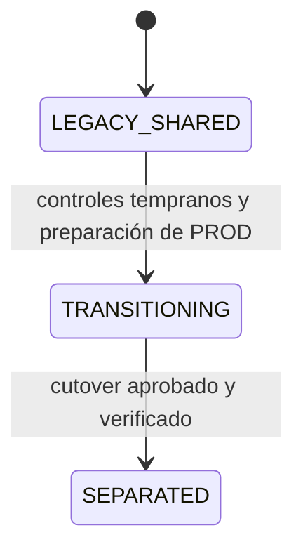
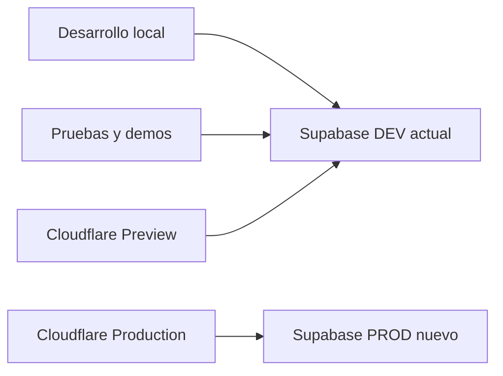

# MikuyApp — PM-002 Separación de ambientes DEV/Preview y PROD: diseño

## D01. Estados y topología objetivo

- `LEGACY_SHARED`: Local, Preview y Production usan el proyecto actual.
- `TRANSITIONING`: Local y Preview siguen en el proyecto actual destinado a DEV; Production continúa allí mientras el PROD nuevo se construye y valida.
- `SEPARATED`: Local/Preview usan DEV actual y Production usa PROD nuevo.

El proyecto actual solo adquiere condición exclusiva de DEV en `SEPARATED`.

No existe enlace de datos entre DEV y PROD. La separación se obtiene por credenciales, variables con ámbitos distintos, guardas de build y procedimientos administrativos separados.

## D02. Contrato de variables

El frontend conserva únicamente:

| Variable | Clasificación | Local | Preview | Production |
|---|---|---|---|---|
| `VITE_SUPABASE_URL` | pública | DEV | DEV | PROD |
| `VITE_SUPABASE_PUBLISHABLE_KEY` | pública | DEV | DEV | PROD |
| identidad esperada de ambiente/ref | pública, sin secreto | DEV | DEV | PROD |

La implementación definirá nombres estables para el estado/identidad lógica y el project ref esperado, por ejemplo `VITE_APP_ENV`, `VITE_ENVIRONMENT_STATE` y `VITE_SUPABASE_PROJECT_REF`. La guardia comparará cuatro datos: contexto real del deployment, identidad lógica declarada, URL/project ref efectivo y project ref esperado.

La matriz de aceptación será sensible al estado: Preview → DEV y Local → DEV son obligatorios desde los controles tempranos; Production → proyecto actual es válido en `LEGACY_SHARED`/`TRANSITIONING`; Production → DEV queda prohibido al declarar `SEPARATED`. No se inspeccionará ni decodificará la publishable key para probar pertenencia. URL/key se validarán juntas mediante conexión o smoke test.

Las credenciales `H2_*` permanecen locales y solo para DEV/pruebas. Los secretos administrativos no usan `VITE_` y no participan en el build del frontend.

## D03. Separación de Cloudflare Pages

Cloudflare Pages debe usar variables scoped:

- **Preview:** URL/key/ref de DEV.
- **Production:** URL/key/ref del proyecto actual durante `LEGACY_SHARED`/`TRANSITIONING`; URL/key/ref de PROD después del cutover.

La configuración se realizará en el proveedor, pero la regla se hará verificable mediante un prebuild acotado que compare contexto, estado/identidad, ref efectivo y ref esperado. Sus pruebas sintéticas cubrirán estados válidos y cruces prohibidos, sin convertir PM-002 en una plataforma general de CI/CD.

No se recomienda mantener un único valor “global” heredado por ambos ámbitos. Los cambios se aplicarán primero a Preview, se verificará DEV y solo después se tocará Production.

## D04. Desarrollo local y operaciones administrativas

El flujo normal será `.env.example` → `.env.local`, apuntando a DEV. La documentación mostrará nombres, no valores. Para reducir errores:

1. el arranque/build local valida que el ambiente declarado sea DEV;
2. PROD no se configura en el archivo local habitual;
3. comandos administrativos requieren un perfil de ejecución separado y confirmación explícita del ref objetivo;
4. logs muestran ambiente/ref enmascarado, nunca claves.

La vinculación local de Supabase CLI no es una frontera de seguridad. Antes de cualquier `db push` futuro se comprobarán organización, project ref e historial. PM-002 no automatiza promociones DEV → PROD.

## D05. Baseline reproducible de PostgreSQL

La fuente autoritativa del esquema es la secuencia ordenada de `supabase/migrations/*.sql`. No se editarán las 28 migraciones aplicadas. La prueba limpia usará PostgreSQL 17 conforme a `config.toml` y ejecutará:

1. inicialización vacía/desechable;
2. 28 migraciones en orden;
3. sin `seed.sql` para el ensayo específico de PROD;
4. consultas de catálogo y pruebas SQL;
5. lint, suite Node, typecheck y build.

El baseline esperado incluye 10 tablas públicas, RLS en las 10, 27 policies, funciones y triggers efectivos, owners/grants de PM-001 y publicación Realtime con `detalle_pedido`, `pedido`, `mesa` pero sin `pago`.

## D06. Auditoría de drift

Se producirán dos inventarios comparables:

- **Repositorio reconstruido:** catálogo generado desde migraciones.
- **DEV alojado:** catálogo remoto leído sin DDL/DML y configuración exportable del Dashboard/API.

La comparación cubrirá tablas, columnas, constraints, índices, secuencias, funciones con firma/cuerpo/metadatos, triggers, grants, RLS, policies, publicación Realtime, extensiones y migraciones registradas. La configuración no SQL se comparará mediante checklist por ambiente.

Cada diferencia tendrá dueño, clasificación y resolución. Solo los elementos indispensables para producción se versionan o documentan. Datos de prueba y cuentas DEV no se promueven.

## D07. Mecanismo acotado de carga inicial

Se separan tres conceptos:

| Artefacto | Uso |
|---|---|
| `supabase/seed.sql` | Demo idempotente de DEV/local; no PROD |
| XLSX `Carga Inicial` | Fuente humana de maestros productivos por aprobar |
| Mecanismo productivo de PM-002 | Carga controlada de los maestros iniciales aprobados necesarios para habilitar PROD |

El mecanismo se elegirá durante construcción según la alternativa más sencilla respaldada por el repositorio. Deberá validar previamente la fuente, respetar dependencias en el orden roles → local → mesas/categorías → productos, aplicar la carga en transacción, controlar duplicados/idempotencia cuando corresponda y reconciliar el resultado sin exponer datos sensibles. No necesita ser un loader reutilizable ni incorporar dry-run/hashes por defecto.

El XLSX actual contiene `POOLPOS`, `M01`, `CEVICHES` y `CEV001`. Se tratarán como datos candidatos, no como aprobación final. No se modificarán ni regenerarán durante Spec Mode.

## D08. Auth y configuración de plataforma

Las cuentas Auth no son migraciones PostgreSQL portables. PROD usará altas nuevas desde un canal administrativo aprobado. El procedimiento será:

1. crear/invitar cuenta sin registrar contraseña en Git;
2. obtener el UUID Auth dentro de la sesión administrativa;
3. ejecutar una copia temporal de la plantilla de perfiles con local/rol por código;
4. verificar perfil activo y acceso esperado;
5. destruir la copia temporal y registrar solo evidencia no sensible.

La configuración de Auth alojado se fijará antes de crear usuarios. `config.toml` sirve de referencia local, pero sus valores como signup habilitado, confirmaciones deshabilitadas y redirects localhost no se promoverán automáticamente a PROD.

## D09. Secuencia de construcción y activación

1. Registrar `LEGACY_SHARED` e inventariar Cloudflare/variables sin cambiar Production.
2. Implementar y probar guardias sensibles al estado; reconstruir baseline y auditar drift.
3. Resolver organización, región, plan, administradores y secretos.
4. Entrar en `TRANSITIONING` y crear PROD con acceso restringido.
5. Aplicar migraciones sin seed demo.
6. Verificar catálogo, RLS, grants, funciones y Realtime.
7. Aprobar Auth, maestros y usuarios; ejecutar carga inicial acotada y alta controlada.
8. Configurar/validar Auth y URLs.
9. Probar directamente PROD con clientes controlados.
10. Configurar Cloudflare Preview → DEV y ejecutar pruebas negativas.
11. Aprobar ventana, responsables, rollback/recuperación y cutover; configurar Cloudflare Production → PROD.
12. Ejecutar smoke/regresión humana y declarar `SEPARATED` solo si la matriz final queda verificada.

## D10. Rollback

La separación no requiere borrar proyectos ni datos. Antes de la primera escritura productiva en el PROD nuevo, si falla la activación:

- restaurar únicamente las variables previas de Cloudflare Production y regresar a `TRANSITIONING`;
- no cambiar Preview, que permanece en DEV;
- pausar accesos productivos nuevos si existe riesgo de escrituras divididas;
- conservar PROD para diagnóstico sin reutilizarlo en pruebas;
- no ejecutar `DROP`, `TRUNCATE`, reset ni copiar datos entre proyectos.

Desde la primera escritura real en PROD, el retorno al proyecto anterior deja de ser rollback simple. Exige una decisión específica de recuperación que evalúe divergencia y fuente de verdad. PM-002 no define sincronización, replicación ni copia para resolver esa divergencia.

## D11. Documentación y gobierno

`PLAN_MVP.md` requiere actualización porque su arquitectura y presupuesto describen un único Supabase. La actualización debe registrar la separación como arquitectura post-MVP sin renumerar Evoluciones 1–5 ni reescribir el histórico H1–H6. `POST_MVP_CHANGELOG.md` recibirá PM-002 solo al cierre, con estado real.

Los runbooks deberán identificar claramente acciones permitidas por ambiente, responsables, evidencia y comandos prohibidos. `acceptance.md` se creará únicamente después de aprobación humana.

## D12. Decisiones cerradas por evidencia

- Se preservan las 28 migraciones y no se editan históricas.
- `seed.sql` no es apto para PROD por su dataset demo.
- El XLSX solo cubre maestros y requiere un mecanismo controlado de carga.
- Auth productivo requiere altas nuevas; no se copian usuarios DEV.
- Realtime deseado se reconstruye desde migración y excluye `pago`.
- Cloudflare necesita scopes separados y una guardia adicional, porque su configuración no está versionada.
- No hace falta limpiar DEV para lograr la separación.
